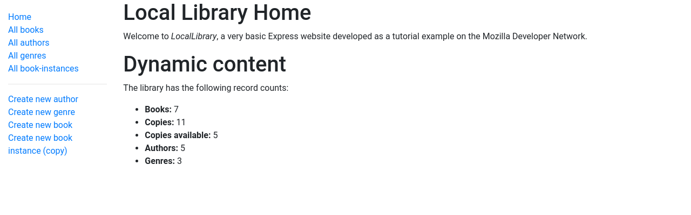

# MDN-Local-Library-Express

### About the project

This project is based on the tutorial which was provided by MDN. The project is for library management. Deployed on Glitch.

Tutorial link : https://developer.mozilla.org/en-US/docs/Learn/Server-side/Express_Nodejs/Tutorial_local_library_website

Desktop screenshot

  <ol>
    
  </ol>

### [Live preview](https://liudasbo-local-library.glitch.me/)

---

### Mainly used technologies:

- NodeJS
- Express.js
- Pug
- Glitch
- MongoDB
- Mongoose
